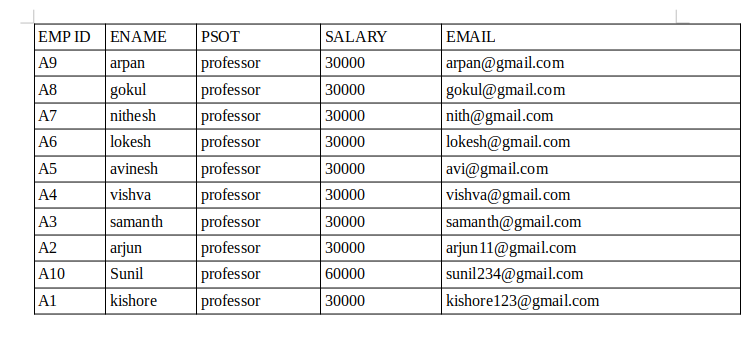
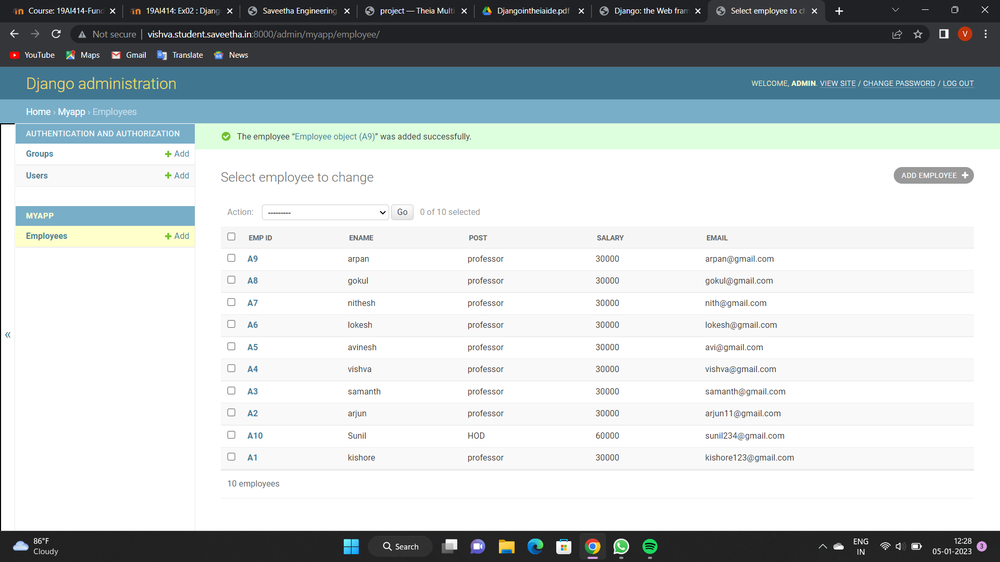
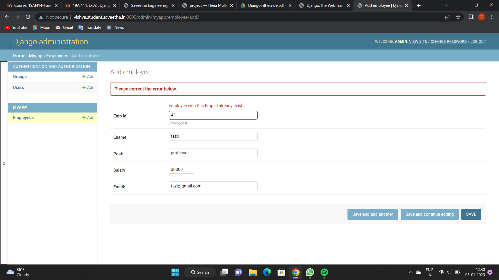

# Django ORM Web Application

## AIM
To develop a Django application to store and retrieve data from a database using Object Relational Mapping(ORM).

## Entity Relationship Diagram

Include your ER diagram here

## DESIGN STEPS

### STEP 1:
Clone repository. Make all changes for the app

### STEP 2:
Test server

### STEP 3:
Finish program and push inn github

Write your own steps

## PROGRAM

from django.contrib import admin
from .models import Employee,EmployeeAdmin

# Register your models here.
admin.site.register(Employee,EmployeeAdmin)

from django.db import models
from django.contrib import admin

class Employee(models.Model):
    emp_id=models.CharField(primary_key=True,max_length=4,help_text="Employee ID")
    ename=models.CharField(max_length=50)
    post=models.CharField(max_length=20)
    salary=models.IntegerField()
    email=models.EmailField()

class EmployeeAdmin(admin.ModelAdmin):
    list_display=('emp_id','ename','post','salary','email')

Include your code here

## OUTPUT

## RESULT
